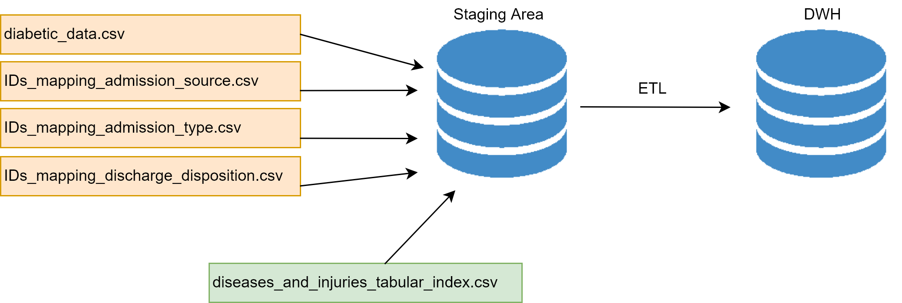

# Data Warehouse of Diabetic Data
Dataset URL - https://archive.ics.uci.edu/ml/datasets/Diabetes+130-US+hospitals+for+years+1999-2008
Attribute Info - https://www.hindawi.com/journals/bmri/2014/781670/tab1/

## Files
- data_warehouse.mwb - MySQL Workbench model file
- dimensional_modeling/dimentional_design.xml - Draw.io file

# Dimensional Model


# Build Data Warehouse


## Step 01 - Create Schema for Staging Area
Use following query to create the database named '*diabetes_dwh_staging*' and tables.
- Database: diabetes_dwh_staging
- Tables:
  1. dataset
  1. admission_source
  1. admission_type
  1. discharge_disposition

Query to execute
```sql

DROP SCHEMA IF EXISTS `diabetes_DWH_staging` ;
CREATE SCHEMA `diabetes_DWH_staging` DEFAULT CHARACTER SET utf8 COLLATE utf8_general_ci ;
USE `diabetes_DWH_staging` ;

CREATE TABLE IF NOT EXISTS `diabetes_DWH_staging`.`dataset` (
  `encounter_id` INT NULL COMMENT '',
  `patient_nbr` INT NULL COMMENT '',
  `race` VARCHAR(45) NULL COMMENT '',
  `gender` VARCHAR(45) NULL COMMENT '',
  `age` VARCHAR(45) NULL COMMENT '',
  `weight` VARCHAR(45) NULL COMMENT '',
  `admission_type_id` INT NULL COMMENT '',
  `discharge_disposition_id` INT NULL COMMENT '',
  `admission_source_id` INT NULL COMMENT '',
  `time_in_hospital` INT NULL COMMENT '',
  `payer_code` VARCHAR(45) NULL COMMENT '',
  `medical_specialty` VARCHAR(45) NULL COMMENT '',
  `num_lab_procedures` INT NULL COMMENT '',
  `num_procedures` INT NULL COMMENT '',
  `num_medications` INT NULL COMMENT '',
  `number_outpatient` INT NULL COMMENT '',
  `number_emergency` INT NULL COMMENT '',
  `number_inpatient` INT NULL COMMENT '',
  `diag_1` VARCHAR(200) NULL COMMENT '',
  `diag_2` VARCHAR(200) NULL COMMENT '',
  `diag_3` VARCHAR(200) NULL COMMENT '',
  `number_diagnoses` INT NULL COMMENT '',
  `max_glu_serum` VARCHAR(45) NULL COMMENT '',
  `A1Cresult` VARCHAR(45) NULL COMMENT '',
  `metformin` VARCHAR(45) NULL COMMENT '',
  `repaglinide` VARCHAR(45) NULL COMMENT '',
  `nateglinide` VARCHAR(45) NULL COMMENT '',
  `chlorpropamide` VARCHAR(45) NULL COMMENT '',
  `glimepiride` VARCHAR(45) NULL COMMENT '',
  `acetohexamide` VARCHAR(45) NULL COMMENT '',
  `glipizide` VARCHAR(45) NULL COMMENT '',
  `glyburide` VARCHAR(45) NULL COMMENT '',
  `tolbutamide` VARCHAR(45) NULL COMMENT '',
  `pioglitazone` VARCHAR(45) NULL COMMENT '',
  `rosiglitazone` VARCHAR(45) NULL COMMENT '',
  `acarbose` VARCHAR(45) NULL COMMENT '',
  `miglitol` VARCHAR(45) NULL COMMENT '',
  `troglitazone` VARCHAR(45) NULL COMMENT '',
  `tolazamide` VARCHAR(45) NULL COMMENT '',
  `examide` VARCHAR(45) NULL COMMENT '',
  `citoglipton` VARCHAR(45) NULL COMMENT '',
  `insulin` VARCHAR(45) NULL COMMENT '',
  `glyburide-metformin` VARCHAR(45) NULL COMMENT '',
  `glipizide-metformin` VARCHAR(45) NULL COMMENT '',
  `glimepiride-pioglitazone` VARCHAR(45) NULL COMMENT '',
  `metformin-rosiglitazone` VARCHAR(45) NULL COMMENT '',
  `metformin-pioglitazone` VARCHAR(45) NULL COMMENT '',
  `change` VARCHAR(45) NULL COMMENT '',
  `diabetesMed` VARCHAR(45) NULL COMMENT '',
  `readmitted` VARCHAR(45) NULL COMMENT '')
ENGINE = InnoDB;

CREATE TABLE IF NOT EXISTS `diabetes_DWH_staging`.`admission_source` (
  `id` INT NULL COMMENT '',
  `description` VARCHAR(255) NULL COMMENT '')
ENGINE = InnoDB;

CREATE TABLE IF NOT EXISTS `diabetes_DWH_staging`.`admission_type` (
  `id` INT NULL COMMENT '',
  `description` VARCHAR(255) NULL COMMENT '')
ENGINE = InnoDB;

CREATE TABLE IF NOT EXISTS `diabetes_DWH_staging`.`discharge_disposition` (
  `id` INT NULL COMMENT '',
  `description` VARCHAR(255) NULL COMMENT '')
ENGINE = InnoDB;
```

## Step 02 - Extract (Import CSV Dataset) to Staging Area
Use the following query to import data to '*datase*' table. Use absolute path to the '*diabetic_data.csv*' file as `<dataset_directory>/diabetic_data.csv` in the query.
**In windows use '/' characters instead of '\\' as path name separator character** (eg: instead of '*D:\dwh\diabetic_data.csv*' use '*D:/dwh/diabetic_data.csv*')

```sql
USE `diabetes_DWH_staging` ;

LOAD DATA INFILE '<dataset_directory>/diabetic_data.csv'
INTO TABLE `dataset`
FIELDS TERMINATED BY ',' ENCLOSED BY '"'
LINES TERMINATED BY '\r\n'
IGNORE 1 LINES;
```

 > If **secure_file_priv** is enabled copy '*diabetic_data.csv*' file to the directory given by following query and use that path.
> ```sql
> SHOW VARIABLES LIKE "secure_file_priv";
> ```
Check whether all 101766 recoreds are imported with executing the query below.
```sql
SELECT COUNT(*) FROM `dataset`;
```

Import *IDs_mapping_admission_source.csv*, *IDs_mapping_admission_type.csv* and *IDs_mapping_discharge_disposition.csv* files as the same way as below.

```sql
LOAD DATA INFILE '<dataset_directory>/IDs_mapping_admission_source.csv'
INTO TABLE `admission_source`
FIELDS TERMINATED BY ',' ENCLOSED BY '"'
LINES TERMINATED BY '\r\n'
IGNORE 1 LINES;

LOAD DATA INFILE '<dataset_directory>/IDs_mapping_admission_type.csv'
INTO TABLE `admission_type`
FIELDS TERMINATED BY ',' ENCLOSED BY '"'
LINES TERMINATED BY '\r\n'
IGNORE 1 LINES;

LOAD DATA INFILE '<dataset_directory>/IDs_mapping_discharge_disposition.csv'
INTO TABLE `discharge_disposition`
FIELDS TERMINATED BY ',' ENCLOSED BY '"'
LINES TERMINATED BY '\r\n'
IGNORE 1 LINES;
```

## Step 03 - Data Cleansing
### 3.1 Create a duplicate data set to make changes
```sql
CREATE TABLE IF NOT EXISTS `diabetes_DWH_staging`.`dataset_modified` (
  `encounter_id` INT NULL COMMENT '',
  `patient_nbr` INT NULL COMMENT '',
  `race` VARCHAR(45) NULL COMMENT '',
  `gender` VARCHAR(45) NULL COMMENT '',
  `age` VARCHAR(45) NULL COMMENT '',
  `weight` VARCHAR(45) NULL COMMENT '',
  `admission_type_id` INT NULL COMMENT '',
  `discharge_disposition_id` INT NULL COMMENT '',
  `admission_source_id` INT NULL COMMENT '',
  `time_in_hospital` INT NULL COMMENT '',
  `payer_code` VARCHAR(45) NULL COMMENT '',
  `medical_specialty` VARCHAR(45) NULL COMMENT '',
  `num_lab_procedures` INT NULL COMMENT '',
  `num_procedures` INT NULL COMMENT '',
  `num_medications` INT NULL COMMENT '',
  `number_outpatient` INT NULL COMMENT '',
  `number_emergency` INT NULL COMMENT '',
  `number_inpatient` INT NULL COMMENT '',
  `diag_1` VARCHAR(200) NULL COMMENT '',
  `diag_2` VARCHAR(200) NULL COMMENT '',
  `diag_3` VARCHAR(200) NULL COMMENT '',
  `number_diagnoses` INT NULL COMMENT '',
  `max_glu_serum` VARCHAR(45) NULL COMMENT '',
  `A1Cresult` VARCHAR(45) NULL COMMENT '',
  `metformin` VARCHAR(45) NULL COMMENT '',
  `repaglinide` VARCHAR(45) NULL COMMENT '',
  `nateglinide` VARCHAR(45) NULL COMMENT '',
  `chlorpropamide` VARCHAR(45) NULL COMMENT '',
  `glimepiride` VARCHAR(45) NULL COMMENT '',
  `acetohexamide` VARCHAR(45) NULL COMMENT '',
  `glipizide` VARCHAR(45) NULL COMMENT '',
  `glyburide` VARCHAR(45) NULL COMMENT '',
  `tolbutamide` VARCHAR(45) NULL COMMENT '',
  `pioglitazone` VARCHAR(45) NULL COMMENT '',
  `rosiglitazone` VARCHAR(45) NULL COMMENT '',
  `acarbose` VARCHAR(45) NULL COMMENT '',
  `miglitol` VARCHAR(45) NULL COMMENT '',
  `troglitazone` VARCHAR(45) NULL COMMENT '',
  `tolazamide` VARCHAR(45) NULL COMMENT '',
  `examide` VARCHAR(45) NULL COMMENT '',
  `citoglipton` VARCHAR(45) NULL COMMENT '',
  `insulin` VARCHAR(45) NULL COMMENT '',
  `glyburide-metformin` VARCHAR(45) NULL COMMENT '',
  `glipizide-metformin` VARCHAR(45) NULL COMMENT '',
  `glimepiride-pioglitazone` VARCHAR(45) NULL COMMENT '',
  `metformin-rosiglitazone` VARCHAR(45) NULL COMMENT '',
  `metformin-pioglitazone` VARCHAR(45) NULL COMMENT '',
  `change` VARCHAR(45) NULL COMMENT '',
  `diabetesMed` VARCHAR(45) NULL COMMENT '',
  `readmitted` VARCHAR(45) NULL COMMENT '')
ENGINE = InnoDB;
```

```sql
INSERT INTO `diabetes_DWH_staging`.`dataset_modified`
SELECT * FROM `diabetes_DWH_staging`.`dataset`;
```

### Horizontal Filtering
Some importants attributes that should be considered are missing in the dataset. Lets discard them.
```sql
DELETE FROM `diabetes_dwh_staging`.`dataset_modified`
WHERE `payer_code` = '?';

DELETE FROM `diabetes_dwh_staging`.`dataset_modified`
WHERE `medical_specialty` = '?';

DELETE FROM `diabetes_dwh_staging`.`dataset_modified`
WHERE `race` = '?';

DELETE FROM `diabetes_dwh_staging`.`dataset_modified`
WHERE `diag_1` = '?';

DELETE FROM `diabetes_dwh_staging`.`dataset_modified`
WHERE `diag_2` = '?';

DELETE FROM `diabetes_dwh_staging`.`dataset_modified`
WHERE `diag_3` = '?';

SELECT COUNT(*) FROM `diabetes_dwh_staging`.`dataset_modified`;
```
We have 26755 data records.

### Cleansing Patient Data

- Select diry data wrt gender of the patient
```sql
CREATE OR REPLACE VIEW `diabetes_dwh_staging`.`dirty_patient_gender` AS
SELECT *
FROM `diabetes_dwh_staging`.`dataset_modified`
WHERE `patient_nbr` in (
	SELECT `patient_nbr`
	FROM `diabetes_dwh_staging`.`dataset_modified`
	WHERE `gender` = 'Female'
) AND `patient_nbr` in (
	SELECT `patient_nbr`
	FROM `diabetes_dwh_staging`.`dataset_modified`
	WHERE `gender` = 'Male'
);

SELECT `encounter_id`, `patient_nbr`, `race`, `gender`
FROM `diabetes_dwh_staging`.`dirty_patient_gender`;
```

There are 2 dirty records with 1 patient and cleaned with selecting most frequent and latest data.
```sql
UPDATE `diabetes_dwh_staging`.`dataset_modified`
SET `gender` = 'Male'
WHERE `patient_nbr` = 109210482;
```

- Select diry data wrt race of the patient
```sql
SELECT distinct `race`
FROM `diabetes_dwh_staging`.`dataset_modified`;
-- 6 distinct races are found. (Caucasian, AfricanAmerican, ?, Other, Asian, Hispanic)

-- Views to identify dirty data
CREATE OR REPLACE VIEW `diabetes_dwh_staging`.`dirty_patient_race` AS
SELECT `patient_nbr`, count(distinct `race`) as `race_count`
FROM `diabetes_dwh_staging`.`dataset_modified`
group by `patient_nbr` having `race_count` > 1;

SELECT count(`patient_nbr`)
FROM `diabetes_dwh_staging`.`dirty_patient_race`;

SELECT `encounter_id`, `patient_nbr`, `race`
FROM `diabetes_dwh_staging`.`dataset_modified`
WHERE `patient_nbr` in (
	SELECT `patient_nbr`
    FROM `diabetes_dwh_staging`.`dirty_patient_race`
)
ORDER BY `patient_nbr`, `encounter_id`;
```

There are 165 dirty records with 50 patients and cleaned with selecting most frequent and latest data.

```sql
-- Set race as Caucasian
UPDATE `diabetes_dwh_staging`.`dataset_modified`
SET `race` = 'Caucasian'
WHERE `patient_nbr` IN (1553220, 23724792, 38893887, 42246738, 52316388, 112367349);

-- Set race as AfricanAmerican
UPDATE `diabetes_dwh_staging`.`dataset_modified`
SET `race` = 'AfricanAmerican'
WHERE `patient_nbr` IN (6919587, 10980891, 40090752, 54643194, 101753730, 107849052);

-- Set race as Other
UPDATE `diabetes_dwh_staging`.`dataset_modified`
SET `race` = 'Other'
WHERE `patient_nbr` IN (28532295, 30689766, 32314608, 33247647, 36967347, 37547937, 37638306, 38774187, 39160719, 42096384, 90817893, 93105117, 93662784, 94027644, 98584524, 100322946, 103228398, 103690161, 105125598, 106425234);

-- Set race as Asian
UPDATE `diabetes_dwh_staging`.`dataset_modified`
SET `race` = 'Asian'
WHERE `patient_nbr` IN (24332220, 31812075, 34248078, 94539465, 97024806, 103305528, 104622570, 110657970, 111534210);

-- Set race as Hispanic
UPDATE `diabetes_dwh_staging`.`dataset_modified`
SET `race` = 'Hispanic'
WHERE `patient_nbr` IN (37572957, 44744166, 45113778, 90035874, 91107549, 93809358, 94088088, 98934615, 106895331, 109448541);
```

## Step 04 - Transforming
### 4.1 Transform primary, secondary and additional diagnosis based on "**International Statistical Classification of Diseases and Related Health Problems**"
- Visit http://icd9.chrisendres.com/index.php?action=contents for Diseases and Injuries Tabular Index

Values are stored to the file **data_transforming/diseases_and_injuries_tabular_index.csv**.

| id | disease                                                                                            | code_letter | code_from | code_to |
|----|----------------------------------------------------------------------------------------------------|-------------|-----------|---------|
|  1 | INFECTIOUS AND PARASITIC DISEASES                                                                  |             |         1 |     139 |
|  2 | NEOPLASMS                                                                                          |             |       140 |     239 |
|  3 | ENDOCRINE, NUTRITIONAL AND METABOLIC DISEASES, AND IMMUNITY DISORDERS                              |             |       240 |     279 |
|  4 | DISEASES OF THE BLOOD AND BLOOD-FORMING ORGANS                                                     |             |       280 |     289 |
|  5 | MENTAL DISORDERS                                                                                   |             |       290 |     319 |
|  6 | DISEASES OF THE NERVOUS SYSTEM AND SENSE ORGANS                                                    |             |       320 |     389 |
|  7 | DISEASES OF THE CIRCULATORY SYSTEM                                                                 |             |       390 |     459 |
|  8 | DISEASES OF THE RESPIRATORY SYSTEM                                                                 |             |       460 |     519 |
|  9 | DISEASES OF THE DIGESTIVE SYSTEM                                                                   |             |       520 |     579 |
| 10 | DISEASES OF THE GENITOURINARY SYSTEM                                                               |             |       580 |     629 |
| 11 | COMPLICATIONS OF PREGNANCY, CHILDBIRTH, AND THE PUERPERIUM                                         |             |       630 |     679 |
| 12 | DISEASES OF THE SKIN AND SUBCUTANEOUS TISSUE                                                       |             |       680 |     709 |
| 13 | DISEASES OF THE MUSCULOSKELETAL SYSTEM AND CONNECTIVE TISSUE                                       |             |       710 |     739 |
| 14 | CONGENITAL ANOMALIES                                                                               |             |       740 |     759 |
| 15 | CERTAIN CONDITIONS ORIGINATING IN THE PERINATAL PERIOD                                             |             |       760 |     779 |
| 16 | SYMPTOMS, SIGNS, AND ILL-DEFINED CONDITIONS                                                        |             |       780 |     799 |
| 17 | INJURY AND POISONING                                                                               |             |       800 |     999 |
| 18 | SUPPLEMENTARY CLASSIFICATION OF FACTORS INFLUENCING HEALTH STATUS AND CONTACT WITH HEALTH SERVICES | V           |         1 |      89 |
| 19 | SUPPLEMENTARY CLASSIFICATION OF EXTERNAL CAUSES OF INJURY AND POISONING                            | E           |       800 |     999 |

### Lets load this csv file into a table.
Replace ***<dataset_directory>*** directory in the query with the absolute path of the file. **Use '/' as path seperator.**
```sql
use diabetes_dwh_staging;

CREATE TABLE IF NOT EXISTS `diabetes_DWH_staging`.`icd9_index` (
  `id` INT NOT NULL COMMENT '',
  `disease` VARCHAR(200) NOT NULL COMMENT '',
  `code_letter` VARCHAR(10) NULL COMMENT '',
  `code_from` INT NOT NULL COMMENT '',
  `code_to` INT NOT NULL COMMENT '',
  PRIMARY KEY (`id`)  COMMENT '')
ENGINE = InnoDB;

LOAD DATA INFILE '<dataset_directory>/diseases_and_injuries_tabular_index.csv'
INTO TABLE `icd9_index`
FIELDS TERMINATED BY ',' ENCLOSED BY '"'
LINES TERMINATED BY '\r\n'
IGNORE 1 LINES;
```

### Transforming ICD9 Details
This query may take several time (~30 seconds) to execute.
```sql
DROP PROCEDURE IF EXISTS `diabetes_dwh_staging`.`TRANSFORM_ICD9`;
DELIMITER ;;

CREATE PROCEDURE `diabetes_dwh_staging`.`TRANSFORM_ICD9`()
BEGIN

DECLARE n INT DEFAULT 0;
DECLARE i INT DEFAULT 0;

-- Transform values starts with V and E
-- Transform "diag_1" values
UPDATE `diabetes_dwh_staging`.`dataset_modified`
SET `diag_1` = (
	SELECT `disease`
    FROM `diabetes_dwh_staging`.`icd9_index`
    WHERE `code_letter` = 'V'
)
WHERE LEFT(`diag_1`, 1) = 'V';

UPDATE `diabetes_dwh_staging`.`dataset_modified`
SET `diag_1` = (
	SELECT `disease`
    FROM `diabetes_dwh_staging`.`icd9_index`
    WHERE `code_letter` = 'E'
)
WHERE LEFT(`diag_1`, 1) = 'E';

-- Transform "diag_2" values
UPDATE `diabetes_dwh_staging`.`dataset_modified`
SET `diag_2` = (
	SELECT `disease`
    FROM `diabetes_dwh_staging`.`icd9_index`
    WHERE `code_letter` = 'V'
)
WHERE LEFT(`diag_2`, 1) = 'V';

UPDATE `diabetes_dwh_staging`.`dataset_modified`
SET `diag_2` = (
	SELECT `disease`
    FROM `diabetes_dwh_staging`.`icd9_index`
    WHERE `code_letter` = 'E'
)
WHERE LEFT(`diag_2`, 1) = 'E';

-- Transform "diag_3" values
UPDATE `diabetes_dwh_staging`.`dataset_modified`
SET `diag_3` = (
	SELECT `disease`
    FROM `diabetes_dwh_staging`.`icd9_index`
    WHERE `code_letter` = 'V'
)
WHERE LEFT(`diag_3`, 1) = 'V';

UPDATE `diabetes_dwh_staging`.`dataset_modified`
SET `diag_3` = (
	SELECT `disease`
    FROM `diabetes_dwh_staging`.`icd9_index`
    WHERE `code_letter` = 'E'
)
WHERE LEFT(`diag_3`, 1) = 'E';


-- Transform values with digits only
SELECT COUNT(*) FROM `diabetes_dwh_staging`.`icd9_index`
WHERE `code_letter` = ''
INTO n;

SET i = 0;
WHILE i < n DO 
	-- Transform "diag_1" values
	UPDATE `diabetes_dwh_staging`.`dataset_modified`
    SET `diag_1` = (
		SELECT `disease`
        FROM `diabetes_dwh_staging`.`icd9_index`
        LIMIT i, 1
	)
    WHERE `diag_1` REGEXP '^[0-9]+\\.?[0-9]*$' AND (
		`diag_1` >= (
			SELECT `code_from`
            FROM `diabetes_dwh_staging`.`icd9_index`
            LIMIT i, 1
		) AND
		`diag_1` <= (
			SELECT `code_to`
            FROM `diabetes_dwh_staging`.`icd9_index`
            LIMIT i, 1
		)
	);
    
	-- Transform "diag_2" values
	UPDATE `diabetes_dwh_staging`.`dataset_modified` SET `diag_2` = (
		SELECT `disease`
        FROM `diabetes_dwh_staging`.`icd9_index`
        LIMIT i, 1
	)
    WHERE `diag_2` REGEXP '^[0-9]+\\.?[0-9]*$' AND (
		`diag_2` >= (
			SELECT `code_from`
            FROM `diabetes_dwh_staging`.`icd9_index`
            LIMIT i, 1
		) AND
		`diag_2` <= (
			SELECT `code_to`
            FROM `diabetes_dwh_staging`.`icd9_index`
            LIMIT i, 1
		)
	);
    
    -- Transform "diag_3" values
	UPDATE `diabetes_dwh_staging`.`dataset_modified` SET `diag_3` = (
		SELECT `disease`
        FROM `diabetes_dwh_staging`.`icd9_index`
        LIMIT i, 1
	)
    WHERE `diag_3` REGEXP '^[0-9]+\\.?[0-9]*$' AND (
		`diag_3` >= (
			SELECT `code_from`
			FROM `diabetes_dwh_staging`.`icd9_index`
			LIMIT i, 1
        ) AND
		`diag_3` <= (
			SELECT `code_to`
			FROM `diabetes_dwh_staging`.`icd9_index`
			LIMIT i, 1
        )
	);
  SET i = i + 1;
END WHILE;

END;;

DELIMITER ;
CALL `diabetes_dwh_staging`.`TRANSFORM_ICD9`();
```

### 4.2 Transform **Admission Type, Discharge Disposition, Admission Source** with given mapping data set.
One procedure will takes around 15 seconds to execute with all take around 45 seconds.

```sql
DROP PROCEDURE IF EXISTS `diabetes_dwh_staging`.`TRANSFORM_ADMISSION_TYPE`;
DROP PROCEDURE IF EXISTS `diabetes_dwh_staging`.`TRANSFORM_ADMISSION_SOURCE`;
DROP PROCEDURE IF EXISTS `diabetes_dwh_staging`.`TRANSFORM_DISCHARGE_DISPOSITION`;
DELIMITER ;;

-- Admission Type
CREATE PROCEDURE `diabetes_dwh_staging`.`TRANSFORM_ADMISSION_TYPE`()
BEGIN

DECLARE n INT DEFAULT 0;
DECLARE i INT DEFAULT 1;

SET n = (SELECT COUNT(*) FROM `diabetes_dwh_staging`.`admission_type`);
-- Add the column
ALTER TABLE `diabetes_dwh_staging`.`dataset_modified`
ADD COLUMN `admission_type` VARCHAR(150);

WHILE i <= n DO
	UPDATE `diabetes_dwh_staging`.`dataset_modified`
    SET `admission_type` = (
		SELECT `description` FROM `diabetes_dwh_staging`.`admission_type` WHERE `id` = i
    )
    WHERE `admission_type_id` = i;
    SET i = i + 1;
END WHILE;

ALTER TABLE `diabetes_dwh_staging`.`dataset_modified`
DROP COLUMN `admission_type_id`;
END;;

-- Admission Source
CREATE PROCEDURE `diabetes_dwh_staging`.`TRANSFORM_ADMISSION_SOURCE`()
BEGIN

DECLARE n INT DEFAULT 0;
DECLARE i INT DEFAULT 1;

SET n = (SELECT COUNT(*) FROM `diabetes_dwh_staging`.`admission_source`);
-- Add the column
ALTER TABLE `diabetes_dwh_staging`.`dataset_modified`
ADD COLUMN `admission_source` VARCHAR(150);

WHILE i <= n DO
	UPDATE `diabetes_dwh_staging`.`dataset_modified`
    SET `admission_source` = (
		SELECT `description` FROM `diabetes_dwh_staging`.`admission_source` WHERE `id` = i
    )
    WHERE `admission_source_id` = i;
    SET i = i + 1;
END WHILE;

ALTER TABLE `diabetes_dwh_staging`.`dataset_modified`
DROP COLUMN `admission_source_id`;
END;;

-- Discharge Disposition
CREATE PROCEDURE `diabetes_dwh_staging`.`TRANSFORM_DISCHARGE_DISPOSITION`()
BEGIN

DECLARE n INT DEFAULT 0;
DECLARE i INT DEFAULT 1;

SET n = (SELECT COUNT(*) FROM `diabetes_dwh_staging`.`discharge_disposition`);
-- Add the column
ALTER TABLE `diabetes_dwh_staging`.`dataset_modified`
ADD COLUMN `discharge_disposition` VARCHAR(150);

WHILE i <= n DO
	UPDATE `diabetes_dwh_staging`.`dataset_modified`
    SET `discharge_disposition` = (
		SELECT `description` FROM `diabetes_dwh_staging`.`discharge_disposition` WHERE `id` = i
    )
    WHERE `discharge_disposition_id` = i;
    SET i = i + 1;
END WHILE;

ALTER TABLE `diabetes_dwh_staging`.`dataset_modified`
DROP COLUMN `discharge_disposition_id`;
END;;

DELIMITER ;
CALL `diabetes_dwh_staging`.`TRANSFORM_ADMISSION_TYPE`();
CALL `diabetes_dwh_staging`.`TRANSFORM_ADMISSION_SOURCE`();
CALL `diabetes_dwh_staging`.`TRANSFORM_DISCHARGE_DISPOSITION`();

```

## Step 05 - Create Schema for Data Warehouse
Exucute following query to create database and tables for Data Warehouse as in the Dimensional Model

```sql
DROP SCHEMA IF EXISTS `diabetes_dwh` ;

CREATE SCHEMA IF NOT EXISTS `diabetes_dwh` DEFAULT CHARACTER SET utf8 COLLATE utf8_general_ci ;
USE `diabetes_dwh` ;

CREATE TABLE IF NOT EXISTS `diabetes_dwh`.`dim_patient` (
  `patient_sk` INT NOT NULL AUTO_INCREMENT COMMENT '',
  `patient_number` VARCHAR(45) NOT NULL COMMENT '',
  `race` VARCHAR(45) NULL COMMENT '',
  `gender` VARCHAR(45) NULL COMMENT '',
  `age` VARCHAR(45) NULL COMMENT '',
  PRIMARY KEY (`patient_sk`)  COMMENT '')
ENGINE = InnoDB;

CREATE TABLE IF NOT EXISTS `diabetes_dwh`.`dim_junk_admissionDetails` (
  `admissionDetail_sk` INT NOT NULL AUTO_INCREMENT COMMENT '',
  `admission_type` VARCHAR(200) NULL COMMENT '',
  `admission_source` VARCHAR(200) NULL COMMENT '',
  `medical_speciality` VARCHAR(200) NULL COMMENT '',
  PRIMARY KEY (`admissionDetail_sk`)  COMMENT '')
ENGINE = InnoDB;

CREATE TABLE IF NOT EXISTS `diabetes_dwh`.`dim_discharge` (
  `discharge_sk` INT NOT NULL AUTO_INCREMENT COMMENT '',
  `discharge_disposition` VARCHAR(150) NULL COMMENT '',
  `readmitted` VARCHAR(45) NULL COMMENT '',
  `payer_code` VARCHAR(45) NULL COMMENT '',
  PRIMARY KEY (`discharge_sk`)  COMMENT '')
ENGINE = InnoDB;

CREATE TABLE IF NOT EXISTS `diabetes_dwh`.`dim_test_results` (
  `test_results_sk` INT NOT NULL AUTO_INCREMENT COMMENT '',
  `glucose_serum_test_result` VARCHAR(45) NULL COMMENT '',
  `a1c_test_results` VARCHAR(45) NULL COMMENT '',
  PRIMARY KEY (`test_results_sk`)  COMMENT '')
ENGINE = InnoDB;

CREATE TABLE IF NOT EXISTS `diabetes_dwh`.`dim_medication` (
  `medication_sk` INT NOT NULL AUTO_INCREMENT COMMENT '',
  `change_of_medication` VARCHAR(45) NULL COMMENT '',
  `diabetes_medicatin` VARCHAR(45) NULL COMMENT '',
  `metformin` VARCHAR(45) NULL COMMENT '',
  `repaglinide` VARCHAR(45) NULL COMMENT '',
  `nateglinide` VARCHAR(45) NULL COMMENT '',
  `chlorpropamide` VARCHAR(45) NULL COMMENT '',
  `glimepiride` VARCHAR(45) NULL COMMENT '',
  `acetohexamide` VARCHAR(45) NULL COMMENT '',
  `glipizide` VARCHAR(45) NULL COMMENT '',
  `tolbutamide` VARCHAR(45) NULL COMMENT '',
  `pioglitazone` VARCHAR(45) NULL COMMENT '',
  `rosiglitazone` VARCHAR(45) NULL COMMENT '',
  `acarbose` VARCHAR(45) NULL COMMENT '',
  `miglitol` VARCHAR(45) NULL COMMENT '',
  `troglitazone` VARCHAR(45) NULL COMMENT '',
  `tolazamide` VARCHAR(45) NULL COMMENT '',
  `examide` VARCHAR(45) NULL COMMENT '',
  `citoglipton` VARCHAR(45) NULL COMMENT '',
  `insulin` VARCHAR(45) NULL COMMENT '',
  `glyburide-metformin` VARCHAR(45) NULL COMMENT '',
  `glipizide-metformin` VARCHAR(45) NULL COMMENT '',
  `glimepiride-pioglitazone` VARCHAR(45) NULL COMMENT '',
  `metformin-rosiglitazone` VARCHAR(45) NULL COMMENT '',
  `metformin-pioglitazone` VARCHAR(45) NULL COMMENT '',
  PRIMARY KEY (`medication_sk`)  COMMENT '')
ENGINE = InnoDB;

CREATE TABLE IF NOT EXISTS `diabetes_dwh`.`dim_junk_diagnosis` (
  `diagnosis_sk` INT NOT NULL AUTO_INCREMENT COMMENT '',
  `primary_diagnosis` VARCHAR(200) NULL COMMENT '',
  `secondary_diagnosis` VARCHAR(200) NULL COMMENT '',
  `additional_diagnosis` VARCHAR(200) NULL COMMENT '',
  PRIMARY KEY (`diagnosis_sk`)  COMMENT '')
ENGINE = InnoDB;

CREATE TABLE IF NOT EXISTS `diabetes_dwh`.`fact_admission` (
  `encounter_id` INT NOT NULL AUTO_INCREMENT COMMENT '',
  `patient_sk` INT NOT NULL COMMENT '',
  `test_sk` INT NOT NULL COMMENT '',
  `medication_sk` INT NOT NULL COMMENT '',
  `diagnosis_sk` INT NOT NULL COMMENT '',
  `date_sk` DATETIME NOT NULL COMMENT '',
  `time_in_hospital` VARCHAR(45) NULL COMMENT '',
  `num_lab_procedure` INT NULL COMMENT '',
  `num_procedures` INT NULL COMMENT '',
  `num_medication` INT NULL COMMENT '',
  `number_outpatient` INT NULL COMMENT '',
  `number_emergency` INT NULL COMMENT '',
  `number_inpatient` INT NULL COMMENT '',
  `number_diagnoses` INT NULL COMMENT '',
  PRIMARY KEY (`encounter_id`)  COMMENT '',
  UNIQUE INDEX `patient_sk_UNIQUE` (`patient_sk` ASC)  COMMENT '',
  UNIQUE INDEX `test_sk_UNIQUE` (`test_sk` ASC)  COMMENT '',
  UNIQUE INDEX `medication_sk_UNIQUE` (`medication_sk` ASC)  COMMENT '',
  UNIQUE INDEX `diagnosis_sk_UNIQUE` (`diagnosis_sk` ASC)  COMMENT '',
  UNIQUE INDEX `date_sk_UNIQUE` (`date_sk` ASC)  COMMENT '')
ENGINE = InnoDB;
```

## Step 06 - Loading Data
### 6.1 Loading to Patient Dimension
There are 19808 distict values.
```sql
INSERT INTO `diabetes_dwh`.`dim_patient` (`patient_number`, `race`, `gender`, `age`)
SELECT DISTINCT `patient_nbr`, `race`, `gender`, `age`
FROM `diabetes_dwh_staging`.`dataset_modified`
ORDER BY `patient_nbr`, `age`;

SELECT COUNT(*) FROM `diabetes_dwh`.`dim_patient`;
```

### 6.2 Loading to Test Results Dimension
There are 7 distict values.
```sql
INSERT INTO `diabetes_dwh`.`dim_test_results` (`glucose_serum_test_result`, `a1c_test_results`)
SELECT DISTINCT `max_glu_serum`, `A1Cresult`
FROM `diabetes_dwh_staging`.`dataset_modified`;

SELECT COUNT(*) FROM `diabetes_dwh`.`dim_test_results`;
```

### 6.3 Loading to Discharge Dimension
There are 339 distict values.
```sql
INSERT INTO `diabetes_dwh`.`dim_discharge` (`discharge_disposition`, `readmitted`, `payer_code`)
SELECT DISTINCT `discharge_disposition`, `readmitted`, `payer_code`
FROM `diabetes_dwh_staging`.`dataset_modified`;

SELECT COUNT(*) FROM `diabetes_dwh`.`dim_discharge`;
```

### 6.4 Loading to Medication Dimension
There are 633 distict values.
```sql
INSERT INTO `diabetes_dwh`.`dim_medication` (
	`change_of_medication`, `diabetes_medicatin`, `metformin`, `repaglinide`,
    `nateglinide`, `chlorpropamide`, `glimepiride`, `acetohexamide`, `glipizide`,
    `tolbutamide`, `pioglitazone`, `rosiglitazone`, `acarbose`, `miglitol`,
    `troglitazone`, `tolazamide`, `examide`, `citoglipton`, `insulin`,
    `glyburide-metformin`, `glipizide-metformin`, `glimepiride-pioglitazone`,
    `metformin-rosiglitazone`, `metformin-pioglitazone`
)
SELECT DISTINCT `change`, `diabetesMed`, `metformin`,
	`repaglinide`, `nateglinide`, `chlorpropamide`, `glimepiride`, `acetohexamide`,
    `glipizide`, `tolbutamide`, `pioglitazone`, `rosiglitazone`, `acarbose`,
    `miglitol`, `troglitazone`, `tolazamide`, `examide`, `citoglipton`, `insulin`,
    `glyburide-metformin`, `glipizide-metformin`, `glimepiride-pioglitazone`,
    `metformin-rosiglitazone`, `metformin-pioglitazone`
FROM `diabetes_dwh_staging`.`dataset_modified`;

SELECT COUNT(*) FROM `diabetes_dwh`.`dim_medication`;
```

### 6.5 Loading to Diagnosis Junk Dimension
Lets load all distinct values for the junk dimension.
There are 2323 distict values.
```sql
INSERT INTO `diabetes_dwh`.`dim_junk_diagnosis` (`primary_diagnosis`, `secondary_diagnosis`, `additional_diagnosis`)
SELECT DISTINCT `diag_1`, `diag_2`, `diag_3`
FROM `diabetes_dwh_staging`.`dataset_modified`;

SELECT COUNT(*) FROM `diabetes_dwh`.`dim_junk_diagnosis`;
```

### 6.6 Loading to Admission Junk Dimension
Lets load all distinct values for the junk dimension.
There are 391 distict values with including NULL values.

```sql
INSERT INTO `diabetes_dwh`.`dim_junk_admissionDetails` (`admission_type`, `admission_source`, `medical_speciality`)
SELECT DISTINCT `admission_type`, `admission_source`, `medical_specialty`
FROM `diabetes_dwh_staging`.`dataset_modified`;

SELECT COUNT(*) FROM `diabetes_dwh`.`dim_junk_admissionDetails`;
```

### 6.7 Loading to Fact
```sql
SELECT `stg`.`encounter_id`,
	`patient`.`patient_sk`, `test`.`test_results_sk`,
    `stg`.`time_in_hospital`, `stg`.`num_lab_procedures`
FROM `diabetes_dwh_staging`.`dataset_modified` as `stg`,
	`diabetes_dwh`.`dim_patient` as `patient`, 
    `diabetes_dwh`.`dim_test_results` as `test`,
    `diabetes_dwh`.`dim_discharge` as `discharge`,
    `diabetes_dwh`.`dim_medication` as `medication`,
    `diabetes_dwh`.`dim_junk_diagnosis` as `diag`,
    `diabetes_dwh`.`dim_junk_admissionDetails` as `adm_details`
WHERE `stg`.`patient_nbr` = `patient`.`patient_number` AND `stg`.`age` = `patient`.`age`
	AND `test`.`glucose_serum_test_result` = `stg`.`max_glu_serum` AND `test`.`a1c_test_results` = `stg`.`A1Cresult`
    AND `stg`.`discharge`.`discharge_disposition` = `discharge_disposition` AND `stg`.`readmitted` = `discharge`.`readmitted` AND `srg`.`payer_code` = `discharge`.`payer_code`;
```

# Data Mining
## Transforming for Data Mining
Transform age to an integer value. (eg transform "[40-50)" to 45)
```sql
DROP PROCEDURE IF EXISTS `diabetes_dwh_staging`.`transform_for_datamining`;
DELIMITER ;;

CREATE PROCEDURE `diabetes_dwh_staging`.`transform_for_datamining`()
BEGIN

DECLARE i INT DEFAULT 0;
DECLARE age_str VARCHAR(10);
DECLARE age_str_int INT;

ALTER TABLE `diabetes_dwh_staging`.`dataset_modified`
ADD COLUMN `age_int` INT;

WHILE i < 10 DO
	SET age_str = CONCAT('[', i * 10, '-', (i+1) * 10, ')');
    SET age_str_int = i * 10 + 5;
    
    UPDATE `diabetes_dwh_staging`.`dataset_modified`
    SET `age_int` = age_str_int
    WHERE `age` = age_str;
    
    SET i = i+1;
END WHILE;

END;;

DELIMITER ;
CALL `diabetes_dwh_staging`.`transform_for_datamining`();
```

## Export CSV file for Data Mining
Lets export `diabetes_dwh_staging`.`dataset_modified` table to csv file. Then it can be used with **weka** for data mining.
Replace ***<dataset_directory>*** directory in the query with the absolute path of the file. **Use '/' as path seperator.**
```sql
SELECT 'race', 'gender', 'age', 'admission_type',
	'discharge_disposition', 'admission_source', 'time_in_hospital', 'payer_code',
    'medical_specialty', 'num_lab_procedures', 'num_procedures', 'num_medications',
    'number_outpatient', 'number_emergency', 'number_inpatient', 'diag_1', 'diag_2',
    'diag_3', 'number_diagnoses', 'max_glu_serum', 'A1Cresult', 'metformin', 'repaglinide',
    'nateglinide', 'chlorpropamide', 'glimepiride', 'acetohexamide', 'glipizide',
    'glyburide', 'tolbutamide', 'pioglitazone', 'rosiglitazone', 'acarbose', 'miglitol',
    'troglitazone', 'tolazamide', 'examide', 'citoglipton', 'insulin', 'glyburide-metformin',
    'glipizide-metformin', 'glimepiride-pioglitazone', 'metformin-rosiglitazone',
    'metformin-pioglitazone', 'change', 'diabetesMed', 'readmitted'
UNION
SELECT `race`, `gender`, `age_int`, `admission_type`,
	`discharge_disposition`, `admission_source`, `time_in_hospital`, `payer_code`,
    `medical_specialty`, `num_lab_procedures`, `num_procedures`, `num_medications`,
    `number_outpatient`, `number_emergency`, `number_inpatient`, `diag_1`, `diag_2`,
    `diag_3`, `number_diagnoses`, `max_glu_serum`, `A1Cresult`, `metformin`, `repaglinide`,
    `nateglinide`, `chlorpropamide`, `glimepiride`, `acetohexamide`, `glipizide`,
    `glyburide`, `tolbutamide`, `pioglitazone`, `rosiglitazone`, `acarbose`, `miglitol`,
    `troglitazone`, `tolazamide`, `examide`, `citoglipton`, `insulin`, `glyburide-metformin`,
    `glipizide-metformin`, `glimepiride-pioglitazone`, `metformin-rosiglitazone`,
    `metformin-pioglitazone`, `change`, `diabetesMed`, `readmitted`
FROM `diabetes_dwh_staging`.`dataset_modified`
INTO OUTFILE 'D:/data_set.csv'
FIELDS TERMINATED BY ',' ENCLOSED BY '"'
LINES TERMINATED BY '\r\n';
```

Now we can import this data set to Weka.