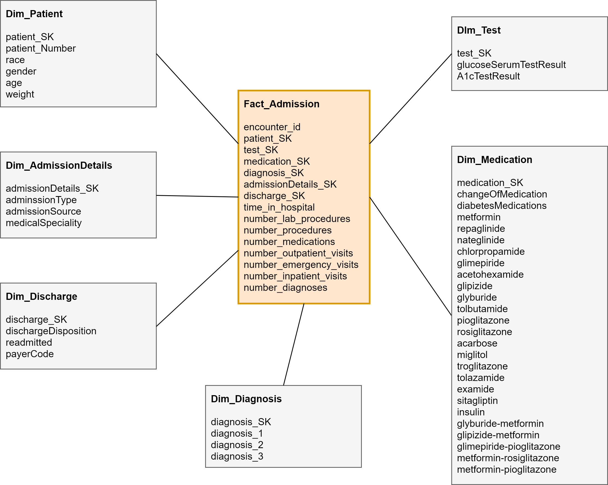

# Data Warehouse of Diabetic Data
Dataset URL - https://archive.ics.uci.edu/ml/datasets/Diabetes+130-US+hospitals+for+years+1999-2008

## Files
- data_warehouse.mwb - MySQL Workbench model file
- dimensional_modeling/dimentional_design.xml - Draw.io file

# Dimensional Model //TODO: update diagram


# Build Data Warehouse
## Step 01 - Create Database and Tables for Data Warehouse
Use following query to create the database named `diabetes_dwh` and tables (identified in Dimensional Model + `dataset` table)
- Database: diabetes_dwh
- Tables:
  1. dataset
  1. other tables //TODO: update tables

Query to execute //TODO: update this query
```sql
CREATE SCHEMA IF NOT EXISTS `diabetes_DWH` DEFAULT CHARACTER SET utf8 COLLATE utf8_general_ci ;
USE `diabetes_DWH` ;
CREATE TABLE IF NOT EXISTS `diabetes_DWH`.`dataset` (
  `id` INT NOT NULL COMMENT '',
  `encounter_id` INT NULL COMMENT '',
  `patient_nbr` INT NULL COMMENT '',
  `race` VARCHAR(255) NULL COMMENT '',
  `gender` VARCHAR(255) NULL COMMENT '',
  `age` VARCHAR(45) NULL COMMENT '',
  `weight` VARCHAR(45) NULL COMMENT '',
  `admission_type_id` VARCHAR(45) NULL COMMENT '',
  `discharge_disposition_id` INT NULL COMMENT '',
  `admission_source_id` VARCHAR(45) NULL COMMENT '',
  `time_in_hospital` VARCHAR(45) NULL COMMENT '',
  `import_csvcol` VARCHAR(45) NULL COMMENT '',
  PRIMARY KEY (`id`)  COMMENT '')
ENGINE = InnoDB;
```

## Step 02 - Extract (Import CSV Dataset to MySQL Database)
Use the following query to import data to `dataset` table. Use absolute path to the `diabetic_data.csv` file as `<csv_file_path>` in the query.
**In windows use '/' characters instead of '\\' as path name separator character**
```sql
LOAD DATA INFILE '<csv_file_path>'
INTO TABLE `dataset`
FIELDS TERMINATED BY ',' ENCLOSED BY '' ESCAPED BY '\\'
LINES TERMINATED BY '\n' STARTING BY ''
```

 > If `secure_file_priv` is enabled copy `diabetic_data.csv` file to the directory given by following query and use that path.
> ```sql
> SHOW VARIABLES LIKE "secure_file_priv";
> ```
Check whether all recoreds are imported with following query.
```sql
SELECT COUNT(*) FROM `dataset`
```

